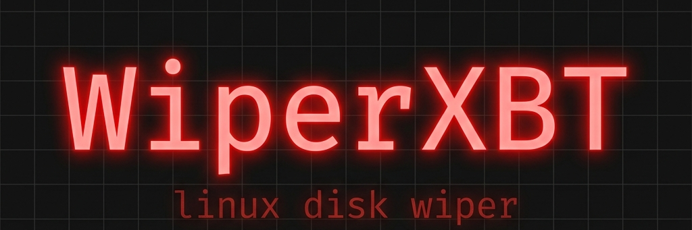

<p align="center">
  
</p>

<p align="center">
  
  
  
  
</p>

Wipes a Linux system's disk and replaces the bootloader with a custom message. Runs entirely from RAM so it can destroy the disk it was launched from.

## What it does

1. Reads its own binary via `/proc/self/exe`, copies it into an anonymous memory fd (`memfd_create`), and re-executes from there. The original file on disk is then unlinked.
2. Resolves the physical parent block device of `/` through `/sys/dev/block` (e.g. `/dev/nvme0n1`).
3. Zeroes out the first 10MB of the disk (wipes partition table and filesystem headers) and the last 33 sectors (wipes the backup GPT).
4. Writes a 512-byte x86 real-mode bootloader to sector 0 that prints a message and halts.
5. Calls `sync()` and reboots immediately.

On the next boot, the machine shows:
```
Star my repo on Github! - amnesia
```
...and hangs.

## Build

```bash
make
```

## Install

```bash
sudo make install
```

During install it will ask you for a custom confirm flag name. Whatever you type becomes the flag baked into that binary. If you leave it blank it defaults to `confirm-force`.

```
Custom confirm flag name (default: confirm-force): nuke
Building with flag: --nuke
Installed to /usr/local/bin/wiperxbt
```

## Usage

```bash
sudo wiperxbt --<your-flag>
```

Without the flag it migrates to RAM and stops, telling you what device it found.

## Notes

- Requires root.
- The bootloader payload is Legacy BIOS / MBR only. On UEFI-only machines without CSM the message won't show, but the disk is still bricked.
- Works on any disk layout — encrypted or not. If the disk is encrypted, data is cryptographically unrecoverable. Unencrypted disks are theoretically recoverable by a forensics lab, but the OS is gone either way.
- **Test in a VM.**
